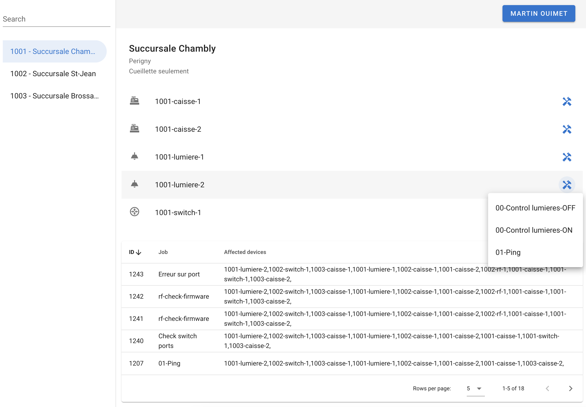

# Open Store Management

Store management powered by Ansible Automation Platform.

### User Interface (store-ui)

The user interface leverages VueJS framework to provide real time dynamic experience. 

### Backend API (store-api)

The backend API is written in Python and contains logics to abstract Ansible Automation Platform API calls. It reduce the amount of calls required by the UI to the backend by consolidate informations from Ansible Automation Platform. 

